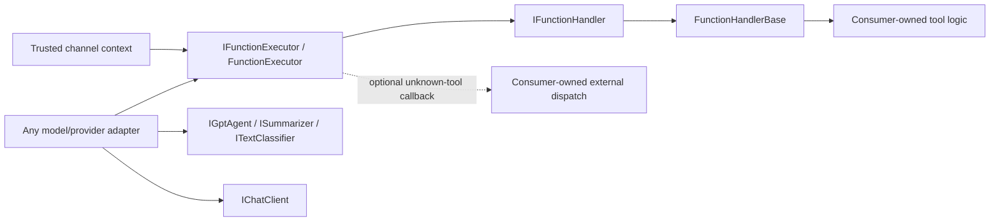
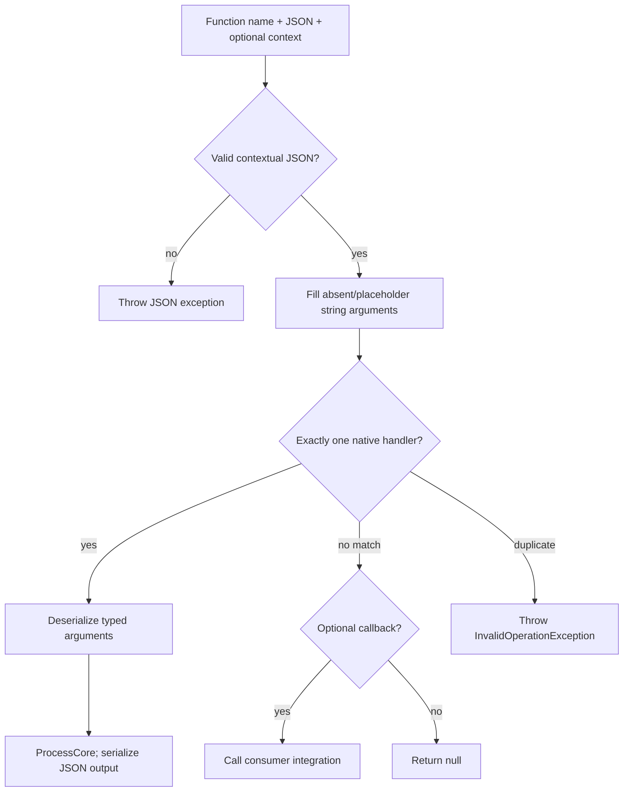
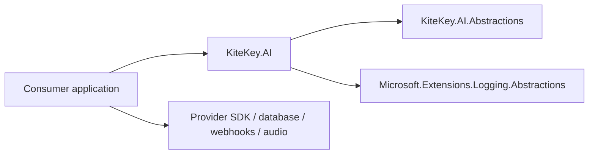
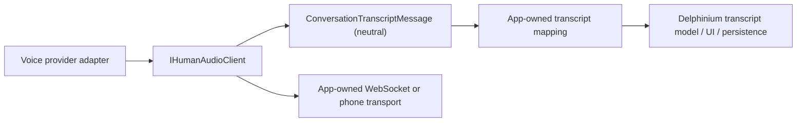

# Architecture

KiteKey.AI extracts only reusable tool and text-processing primitives. The abstractions assembly has no third-party dependencies; the implementation assembly needs logging abstractions only. Model providers and application persistence stay with consumers.

## Dispatch

The contextual overload retains Delphinium's placeholder handling but rejects malformed or null JSON instead of silently forwarding it. JSON and typed handler calls propagate exceptions, including cancellation; null results throw. Consumers decide how to communicate errors to their users at the transport boundary.

## Boundaries

## Voice transport

`IHumanAudioClient` and its transcript payload reside in Abstractions. The app implements the transport and translates neutral transcript fields into its own DTO; no persistence type crosses into the package. Voice adapters use `SendAudio(byte[])`, converting provider-specific binary wrappers at their edge. Browser audio and Twilio implementations remain in the app.

There are no references from either package to Delphinium, Entity Framework, Azure, or Twilio. `RequiredToolCall` carries SDK-neutral call details; provider adapters translate their SDK types at the boundary.
