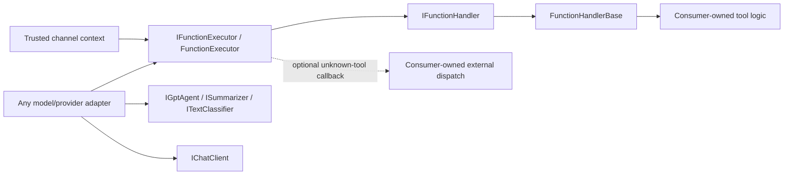
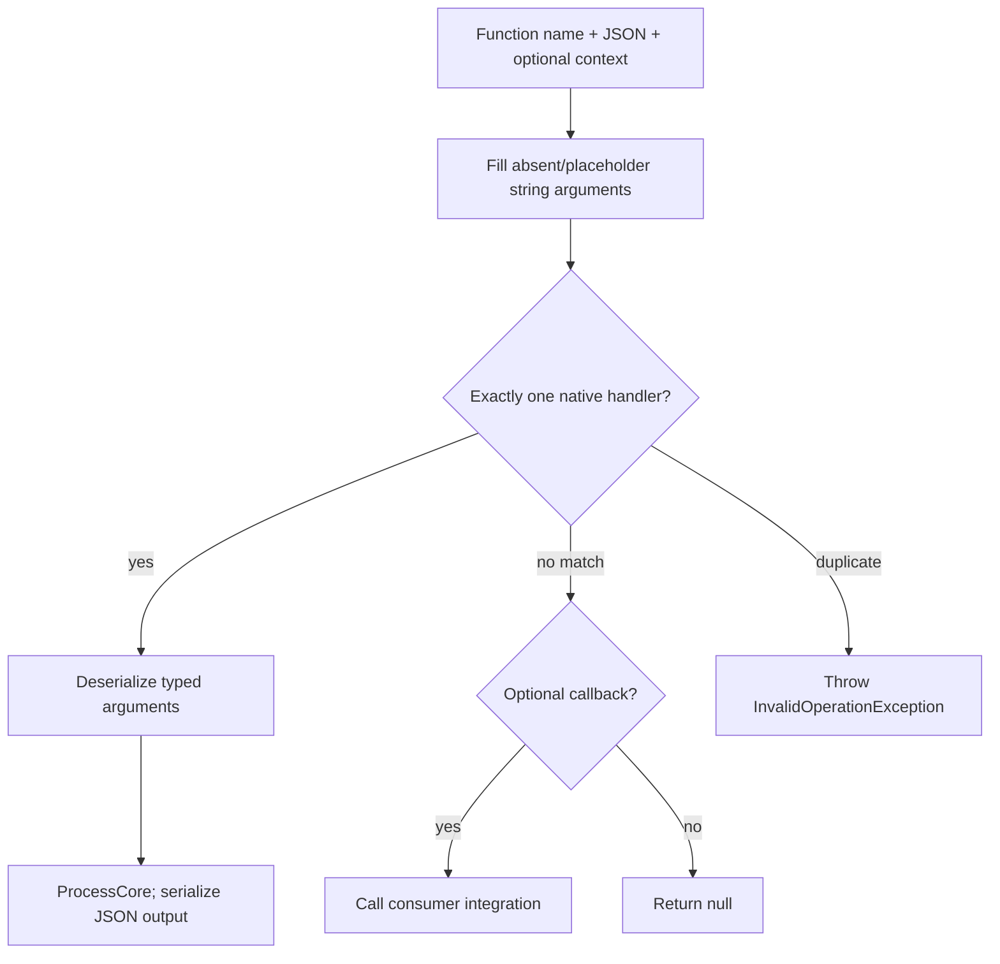
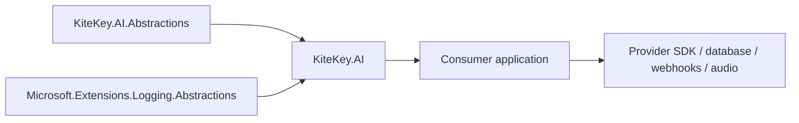

# Architecture

KiteKey.AI extracts only reusable tool and text-processing primitives. The abstractions assembly has no third-party dependencies; the implementation assembly needs logging abstractions only. Model providers and application persistence stay with consumers.

## Dispatch

The contextual overload retains Delphinium's placeholder handling and malformed-JSON passthrough. JSON handlers return a serialized `message` error on failures; typed calls propagate errors. A consumer decides whether to expose exception messages to its users.

## Boundaries

There are no references from either package to Delphinium, Entity Framework, Azure, or Twilio. `RequiredToolCall` carries SDK-neutral call details; provider adapters translate their SDK types at the boundary. Delphinium's browser audio adapter depends on application-specific transcript and stream types, so audio and Twilio remain outside these packages.
